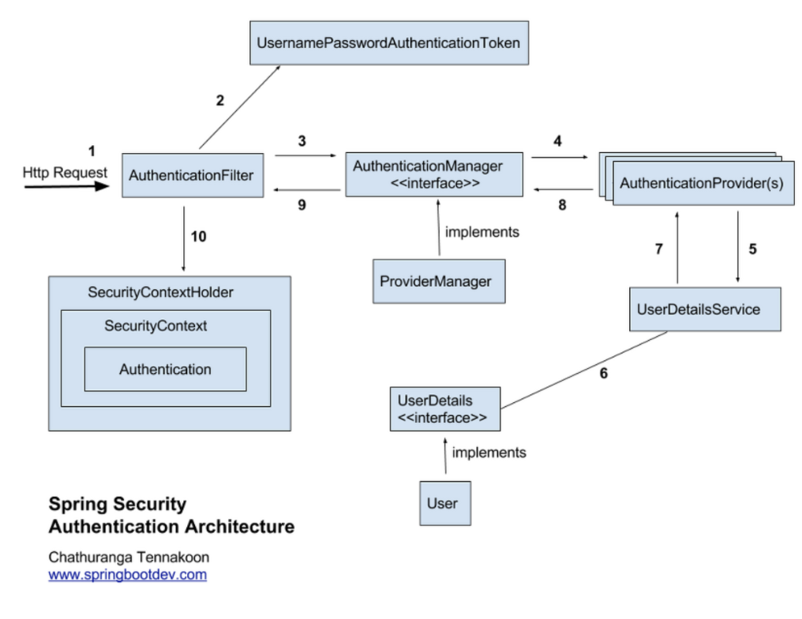

### Spring Security 분석

#### Spring 동작 구조

---

#### 동작 프로세스 간략화

1. 로그인을 요청한다.
2. `AuthenticationFilter` 가 동작한다.
   - 로그인 요청시 받은 데이터로 `UsernamePasswordAuthenticationToken`를 만든다.
   - 해당 인증 토큰객체로 이후 인증을 진행한다.
3. `AuthenticationManager` 가 인증을 위임받는다.
4. 실제로 인증과 관련된 모든 프로세스는 `AuthenticationProvider` 에서 진행된다.
5. `UserDetailsService` 에서 로그인시 받은 `username` 으로 사용자를 조회하고, 이후 로직에서 `password`를 비교한다음 인증 토큰객체를 반환한다.
6. 인증이 완료되었으므로, 인증 토큰을 `AuthenticationFilter`가 최종적으로 받아서 `SecurityContextHolder`에 저장한다.

